# FSOCO
<small>Formula Student Objects in Context</small>

## What?
Open-Source Dataset for Objects that need to be recognized during the dynamic disciplines of the Formula Student Driverless competitions.


| Team  | Data Type  | Annotation Type  | # Data | # Cones |
|---|---|---|---|---|
| municHMotorsport e.V.  | Color Images  | Darknet YOLO Format | 3745 | 18697 |
| Elbflorace e.V.  |  Color Images |  Darknet YOLO Format | 853 | 3791 |
| SCUTRacing  |  Color Images |  Darknet YOLO Format | 792 | 5896 |
| DHBW Engineering e.V.  |  Color Images |  VOC | 600 | 5794 |
| StarkStrom Augsburg e.V  | Color Images  | Darknet YOLO Format  | 1120 | 7501 |
| AMZ Racing | Color Images | Darknet YOLO Format | 791 | 5685 |
| ITU Racing | Color Images  | Darknet YOLO Format  | 600 | 8241 |
| Raceyard | Color Images  | MM-Label Tool Format | 600 | 9491|
| EUFS | Color Images| Darknet YOLO Format | 1094 | 4594 |
| Dimitris Martin Arampatzis | Color Images | Darknet YOLO Format | 600 | 12333 |
| Unicamp E-Racing Driverless | Color Images | Darknet YOLO Format | 844 | 6699 |
| KTHFS | Color Images | Darknet YOLO Format | 630 | 3434 |
| GETracing Dortmund | Color Images | Darknet YOLO Format | 600 | 1454 |
| Vermilion Racing | Color Images | Darknet YOLO Format | 897 | 3422 |
| DART Racing | Color Images | LabelMe Webtool | 1658 | 22690 |
| Fast Forest | Color Images | Darknet YOLO Format | 603 | 9503 |
| FS Team Tallinn | Color Images | Darknet YOLO Format | 645 | 1650 |
| BME Formula Racing Team | Color Images | Darknet YOLO Format | 1763 | 27877 |
| Driverless UPC          | Color Images | VOC | 776 | 3885 |
| Global-Formula-Racing|Color Images | Coco | 646 | 7146 |
| High-Octane Motorsports e.V. | Color Images | Darknet YOLO Format | 860 | 1895 |
| GreenTeam Uni Stuttgart | Color Images | Darknet YOLO Format | 827 | 4245 |
| FS Team Weingarten | Color Images | Darknet YOLO Format | 920 | 3220 |
| Mit Dut Colab | Color Images | North American Standard | 4452 | 55357 |
| Wisconsin Autonomous | Color Images | Darknet YOLO Format | 630 | 3338 |
| e-gnition Hamburg | Color Images | Darknet YOLO Format | 700 | 3685 |
| eForce Driverless | Color Images | Darknet YOLO Format | 600 | 4676 |
|Arist.u.r.t.le. | Color Images | Darknet YOLO Format | 3127 | 13234 |
| Horsepower Hannover | Color Images | Darknet YOLO Format | 4373 | 7941 |
|Dynamis PRC | Color Images | Darknet YOLO Format | 600 | 5894 |
| FST Lisboa | Color Images | Darknet YOLO Format | 655 | 4221 |
| UPBracing Team e.V. | Color Images | Darknet YOLO Format | 949 | 8570 |
| Formula Electric Belgium | Color Images | Darknet YOLO Format | 600 | 4874 |
| STUBA Green Team | Color Images | Darknet YOLO Format | 1996 | 3346 |
| FaSTTUBe | Color Images | Darknet YOLO Format | 605 | 2196 |
| CURE Mannheim  |  Color Images |  VOC | 600 | 3052 |
| E-Team Squadra Corse | Color Images | Darknet YOLO Format & COCO Format | 600 | 782 |
| Bauman Racing Team | Color Images | Darknet YOLO Format | 600 | 7159 |
| Lions Racing Braunschweig  |  Color Images |  Darknet YOLO Format | 644 | 9196 |
|...|...|...|...|...|

### Annotation Types

Here you'll find the definitions for all different annotation types appearing in the datasets. If you need the labels in another format, please look for the according script in the [scripts folder](https://github.com/ddavid/fsoco/tree/master/scripts) or write one and share your solution - sharing is caring ;)

#### Darknet YOLO

Darknet uses normalized image dimensions for the labels and defines the regions-of-interest (ROI) by their **class**, **mid-point**, **width** and **height**

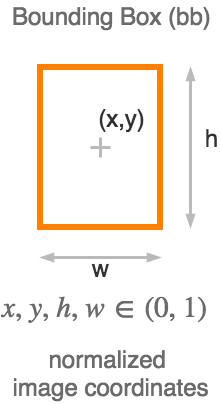

```bash
# darknet-label.txt

0 0.255078125 0.545833333333 0.02421875 0.0583333333333
0 0.41328125 0.613194444444 0.040625 0.081944444444
0 0.81015625 0.780555555556 0.0734375 0.15
```

[class index][mid_x][mid_y][width][height]

#### VOC

VOC is a xml based description format.
A label will be similiar to:

```xml
<object>
    <name>yellow-cone</name>
    <pose>Unspecified</pose>
    <truncated>0</truncated>
    <difficult>0</difficult>
    <polygon>
        <x1>877</x1>
        <y1>571</y1>
        <x2>897</x2>
        <y2>528</y2>
        <x3>916</x3>
        <y3>576</y3>
    </polygon>
</object>
```

VOC can be converted to Darknet YOLO by using the script provided in this repo.
DHBW Engineering used polygons for marking the cones.
An example:

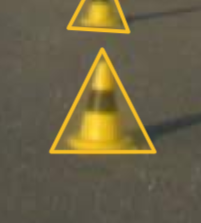

#### Munich Labeling Tool (https://github.com/ddavid/MM-label-tool)

[# cones]

[minX][minY][maxX][maxY][labelname][dist_from_width][dist_from_height]

The position is given in absolute pixel values, the distance is calculated in metres.

There is a converter to Darknet YOLO in Scripts.

#### North American Standard

The North American Standard system makes use of single .csv files containing the labels. Each row, other than the first, represents a new image. Each column, other than the first two, represent a label for that particular image.

The label format adheres to the following convention: [X-top_left, Y-top_left, Image Height, Image Width]. Note that all dimensions are in absolute pixel values. The first two columns consist of the image name and optionally a link to a public server hosting the images for convenient downloading.

A parser for converting these .csv files to a python list can be found in the scripts folder. This particular dataset does not include class labels. 

#### LabelMe Webtool

LabelMe Webtool is a online labeling tool developed from [MIT CSAIL](https://www.csail.mit.edu/)
The following XML format is produced

```xml
<annotation>
    <filename>yellow-cone</filename>
    <folder>yellow-cone</folder>
    <source>
        <sourceImage>The MIT-CSAIL database of objects and scenes</sourceImage>
        <sourceAnnotation>LabelMe Webtool</sourceAnnotation>
    </source>
    <object>
        <name>orange_big</name>
        <deleted>0</deleted>
        <verified>0</verified>
        <occluded>no</occluded>
        <attributes/>
        <parts>
            <hasparts/>
            <ispartof/>
        </parts>
        <date>01-Jun-2018 17:53:36</date>
        <id>0</id>
        <type>bounding_box</type>
        <polygon>
            <username>anonymous</username>
            <pt><x>265</x><y>762</y></pt>
            <pt><x>339</x><y>762</y></pt>
            <pt><x>339</x><y>620</y></pt>
            <pt><x>265</x><y>620</y></pt>
        </polygon>
    </object>
    <object></object>
    ...
    <object></object>
    <imagesize>
        <nrows>1080</nrows>
        <ncols>1920</ncols>
    </imagesize>
</annotation>
```


More information can be found [here](http://labelme.csail.mit.edu/Release3.0/)


## Who?
* [municHMotorsport e.V.](https://www.munichmotorsport.de/)  

<a href="https://www.munichmotorsport.de/"></a>

* [Elbflorace e.V](https://www.elbflorace.de/en/)  

<a href="https://www.elbflorace.de/en/"></a>
* [SCUTRacing](http://www.scutracing.com/)  

<a href="http://www.scutracing.com/"></a>
* [DHBW Engineering e.V.](https://dhbw-engineering.de/)

<a href="https://dhbw-engineering.de/"></a>

* [StarkStrom Augsburg e.V.](https://starkstrom-augsburg.de/)

<a href="https://starkstrom-augsburg.de/"></a>

* [AMZ Racing](http://amzracing.ch/)

<a href="http://amzracing.ch/"></a>

* [ITU Racing](http://racing.itu.edu.tr/)

<a href="http://racing.itu.edu.tr/">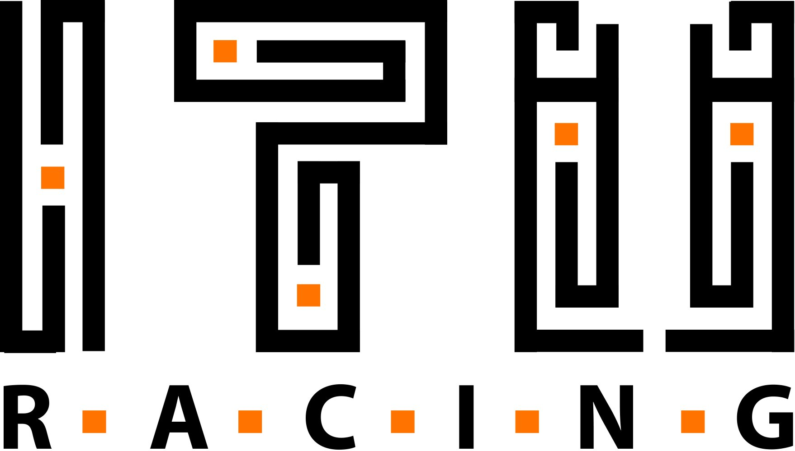</a>

* [Raceyard](https://www.raceyard.de/)

<a href="https://www.raceyard.de//">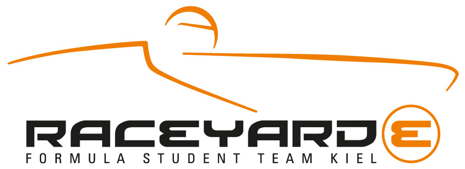</a>

* [EUFS](https://eufs.eusa.ed.ac.uk/)

<a href="https://eufs.eusa.ed.ac.uk/">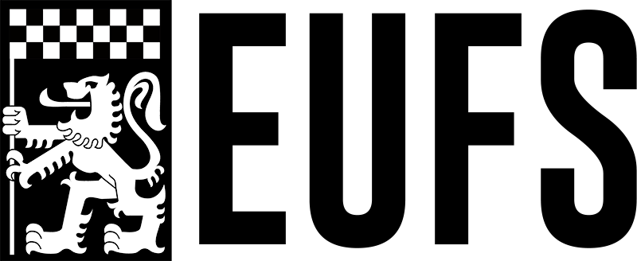</a>

* [UNICAMP E-Racing](https://www.unicamperacing.com/)

<a href="https://www.unicamperacing.com/">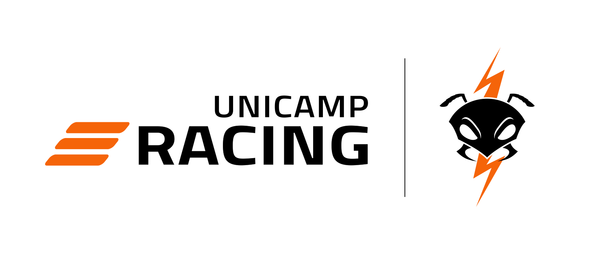</a>

* [GET Racing Dortmund](https://www.get-racing.de/)

<a href="https://www.get-racing.de/"></a>

* [Vermilion Racing](https://vermilionracing.com/)

<a href="https://vermilionracing.com/"></a>

* [DART Racing](https://dart-racing.de/index.php/news_und_medien.html)

<a href="https://dart-racing.de/index.php/news_und_medien.html">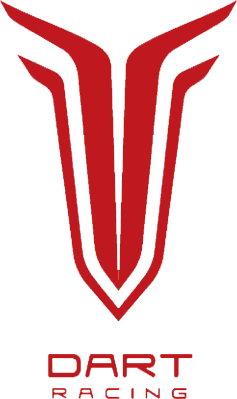</a>

* [Fast Forest](https://www.fast-forest.de/) 

<a href="https://www.fast-forest.de/"></a>

* [FS Team Tallinn](https://formulastudent.ee/en/)  

<a href="https://formulastudent.ee/en/"></a>

* [BME Formula Racing Team](http://www.frt.bme.hu/) 

<a href="http://www.frt.bme.hu/"></a>

* [Driverless UPC](https://driverless.upc.edu/)

<a href="https://driverless.upc.edu/">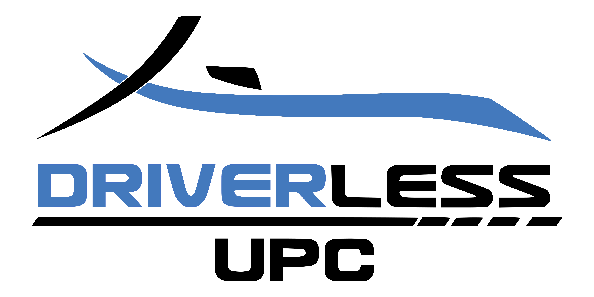</a>

* [Global-Formula-Racing](https://www.global-formula-racing.com/)

<a href="https://www.global-formula-racing.com/">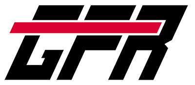</a>

* [High-Octane Motorsports e.V.](http://www.octanes.de)

<a href="https://www.octanes.de">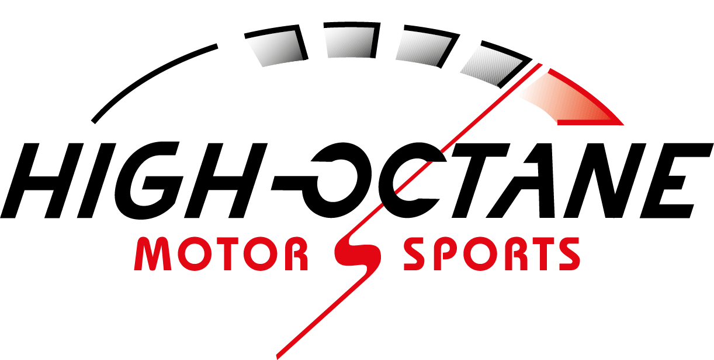</a>

* [Green Team Driverless](https://driverless.greenteam-stuttgart.de/)

<a href="https://driverless.greenteam-stuttgart.de/"></a>

* [FS Team Weingarten](https://www.fsteamweingarten.de/)

<a href="https://www.fsteamweingarten.de/">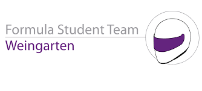</a>

* [Formula Student Team Delft Driverless](https://www.fsteamdelft.nl/driverless)

<a href="https://www.fsteamdelft.nl/driverless"></a>

* [Wisconsin Autonomous](http://vehicle.slc.engr.wisc.edu/)

<a href="http://vehicle.slc.engr.wisc.edu/">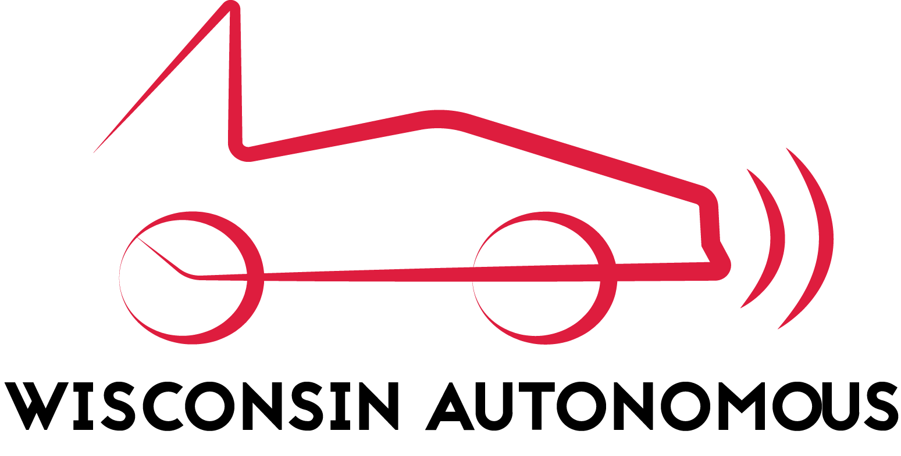</a>

* [e-gnition Hamburg](https://www.egnition.hamburg/start)

<a href="https://www.egnition.hamburg/start"></a>

* [e-force Prague](https://eforce.cvut.cz/en/)

<a href="https://eforce.cvut.cz/en/"></a>

* [Aristotle University Racing Team Electric](http://aristurtle.gr/index.php/en/)

<a href="http://aristurtle.gr/index.php/en/">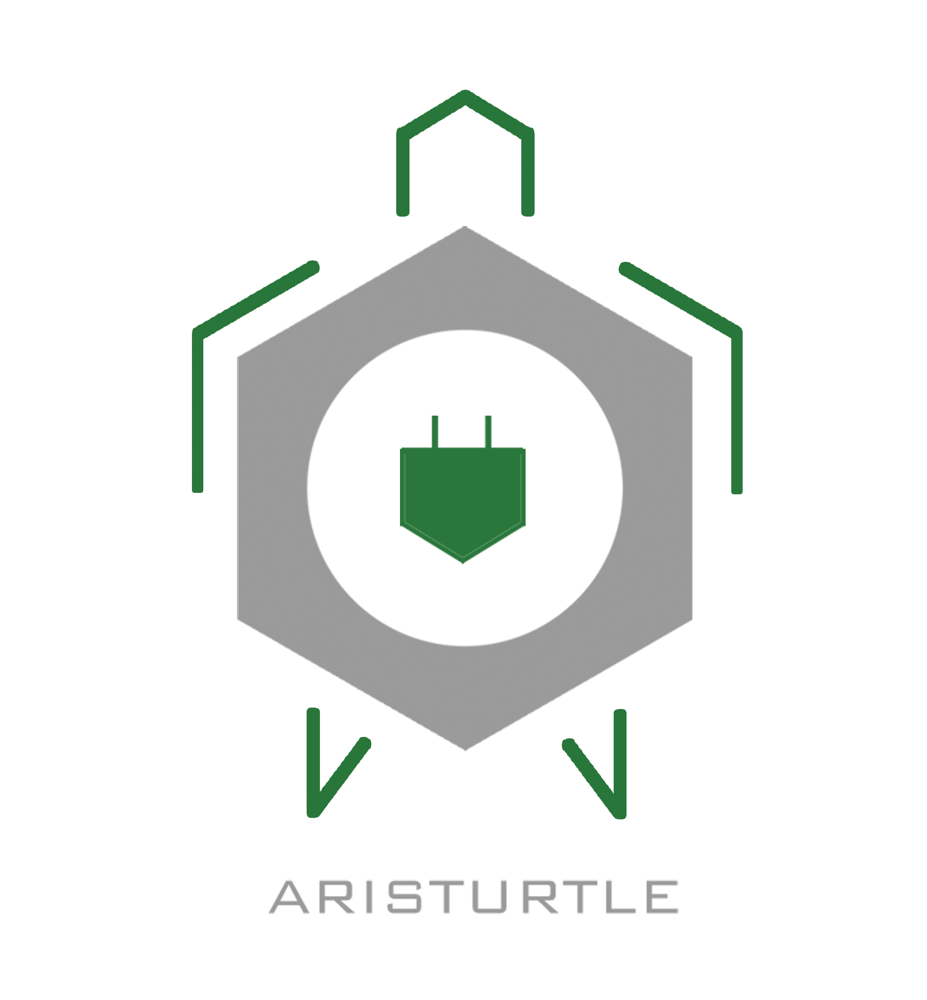</a>

* [Horsepower Hannover](https://www.horsepower-hannover.de/)

<a href="https://www.horsepower-hannover.de/"></a>

* [Dynamis PRC](https://www.dynamisprc.com/)

<a href="https://www.dynamisprc.com/">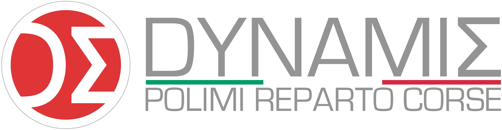</a>

* [UPBracing Team e.V.](https://formulastudent.uni-paderborn.de)

<a href="https://formulastudent.uni-paderborn.de">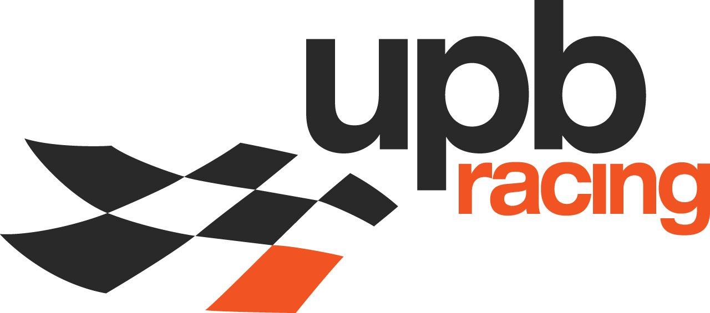</a>

* [Formula Electric Belgium](https://formulaelectric.be/)

<a href="https://formulaelectric.be/">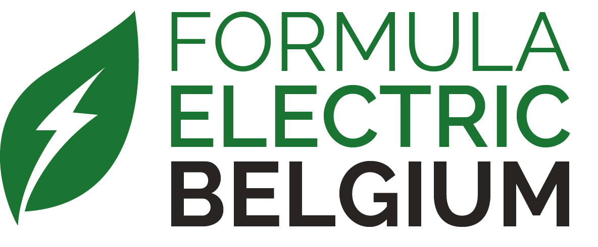</a>

* [STUBA Green Team](http://sgteam.eu/)

<a href="http://sgteam.eu/">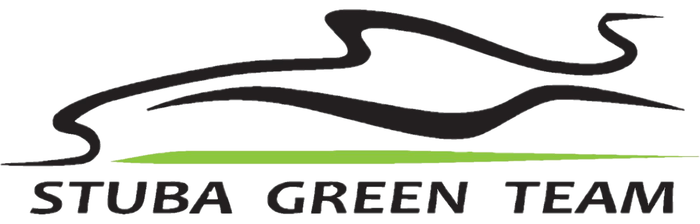</a>

* [FaSTTUBe](https://fasttube.de)

<a href="https://fasttube.de"></a>

* [CURE Mannheim](http://curemannheim.de/)

<a href="http://curemannheim.de/">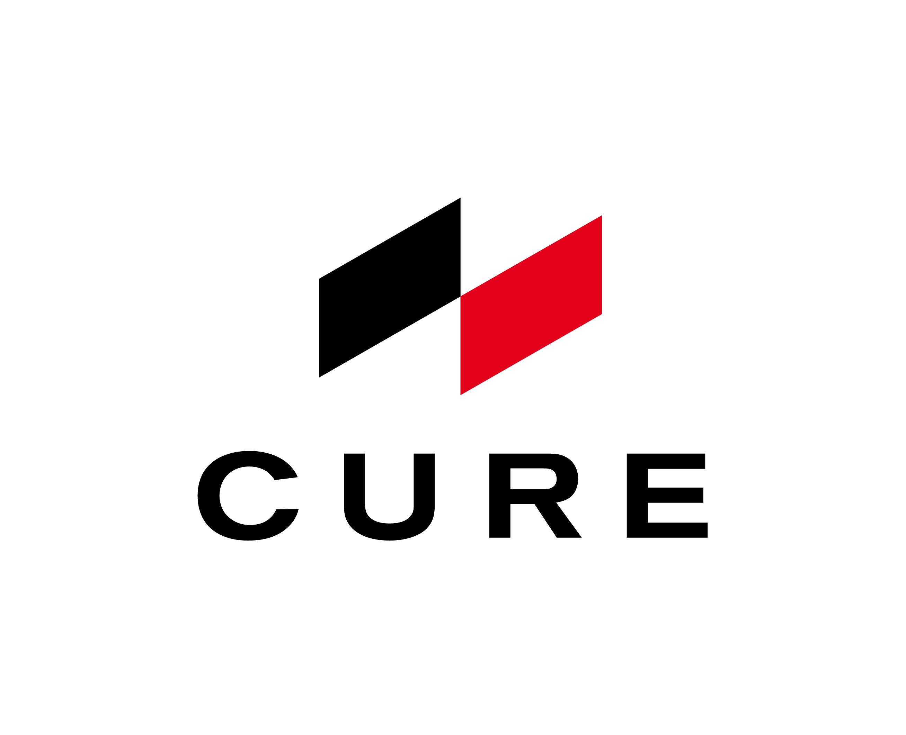</a>

* [E-Team Squadra Corse](http://www.eteamsquadracorse.it/)

<a href="http://www.eteamsquadracorse.it/">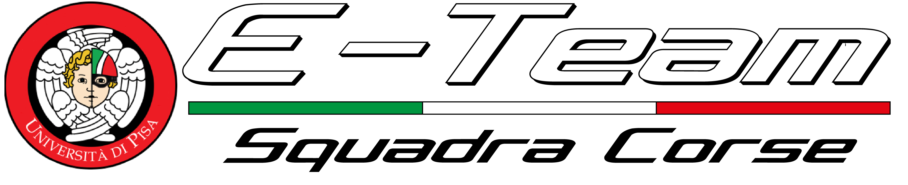</a>

* [Bauman Racing Team](https://baumanracing.ru/)

<a href="https://baumanracing.ru/"></a>

* [Lions Racing Team Braunschweig](https://lionsracing.de)

<a href="https://lionsracing.de">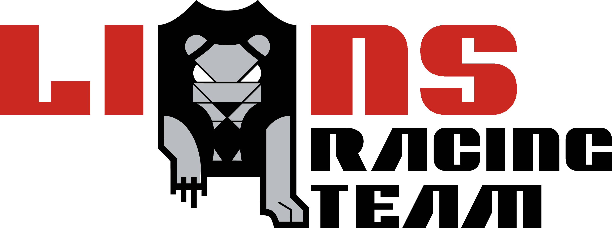</a>

*...

## Why?
Open-Source Dataset to accelerate the development of (camera-based) solutions for **Object Detection** in the context of the Formula Student Driverless competitions.
Collecting raw data and annotating it accordingly is important, but is not feasible to be done well enough by one team within the time constraints of the competition.
